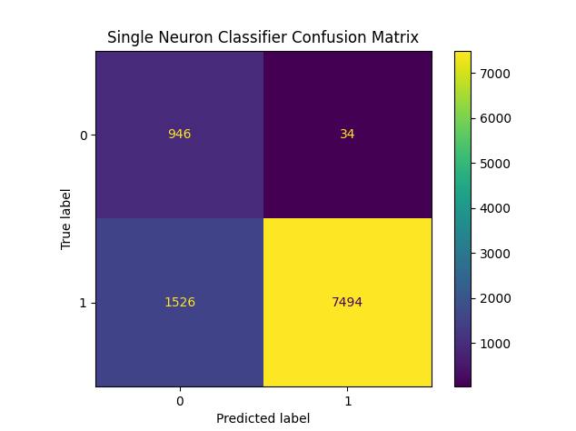
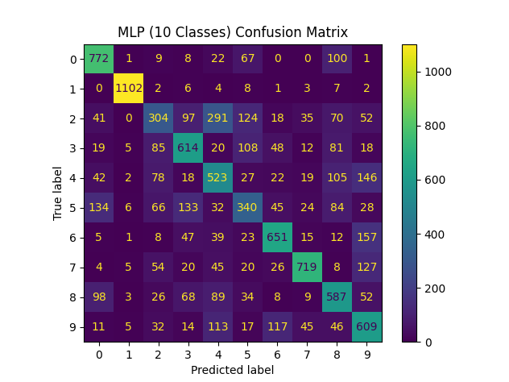

#Embedded Digital Image Processing HW4
# MNIST Digit Classification Using Hu Moments and Neural Networks

This project demonstrates handwritten digit classification on the **MNIST dataset** using **Hu Moments** as shape-based features and neural network models. Instead of raw pixel values, each digit image is represented by 7 Hu Moment features. Two classification approaches are implemented and compared.

---

**Members:**
| Name               | Student ID |
|--------------------|--------------|
| **Eren Karagül**   | 150722007     |
| **Mehmet Akif Takcı** | 150721058   |

---

## Project Overview

The project consists of two experiments:

1. **Binary Classification (Q1)**  
   Classifies whether a digit is **0** or **not 0** using a **single-neuron model**.

2. **Multi-Class Classification (Q2)**  
   Classifies digits **0–9** using a **Multi-Layer Perceptron (MLP)**.

Both models are trained and evaluated using confusion matrices.
For each image, **7 Hu Moments** are computed using OpenCV.

---
Q1 – Training the single neuron for handwritten digit recognition from digital images

  

---

Q2 - handwritten digit recognition from digital images

  

